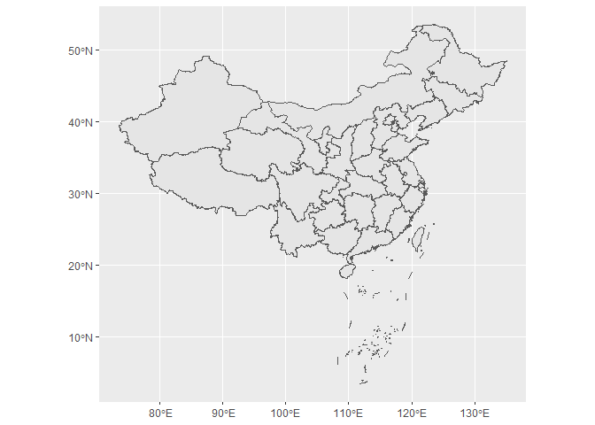

cnmap: China Map Data from AutoNavi Map

According to the code or the name of the administrative division at the county level and above provided by the Ministry of Civil Affairs of the People's Republic of China in 2022 (<https://www.mca.gov.cn/mzsj/xzqh/2022/202201xzqh.html>), get the map file online from the website of AutoNavi Map (<http://datav.aliyun.com/portal/school/atlas/area_selector>).

### Installation

Install the latest CRAN release via command:

    install.packages("cnmap")

### Usage 1

    library(ggplot2)
    library(sf)

    ## Linking to GEOS 3.11.2, GDAL 3.8.2, PROJ 9.3.1; sf_use_s2() is TRUE

    library(cnmap)

    map1 <- getMap(name = "中国")
    ggplot(data = map1) + geom_sf()

### Usage 2

    map2 <- getMap(code = "100000", subRegion = TRUE) 
    ggplot(data = map2) + geom_sf()

### Usage 3

    map3 <- getMap(name = "吉林省", subRegion = TRUE)
    ggplot(data = map3) + geom_sf()

### Usage 4

    map4 <- getMap(name = "长春市", subRegion = TRUE)
    ggplot(data = map4) + geom_sf()

### Usage 5

    map5 <- getMap(code = "220100", subRegion = TRUE) 
    ggplot(data = map5) + geom_sf()

map4 is equivalent to map5.

### Usage 6

    map6 <- getMap(name = "香港特别行政区", subRegion = TRUE)
    ggplot(data = map6) + geom_sf()

